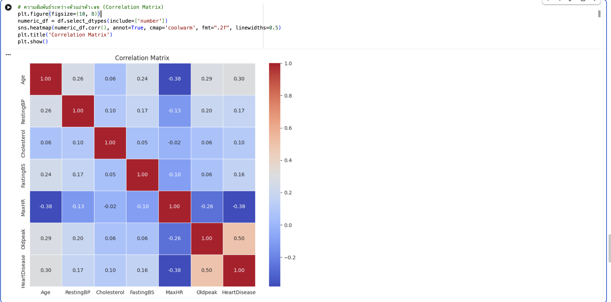
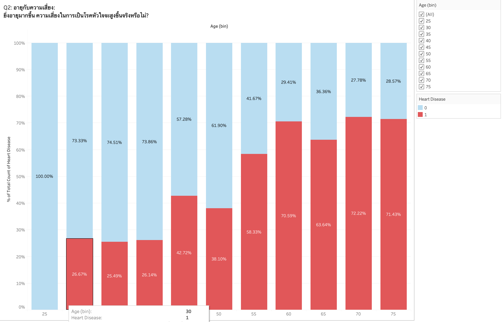
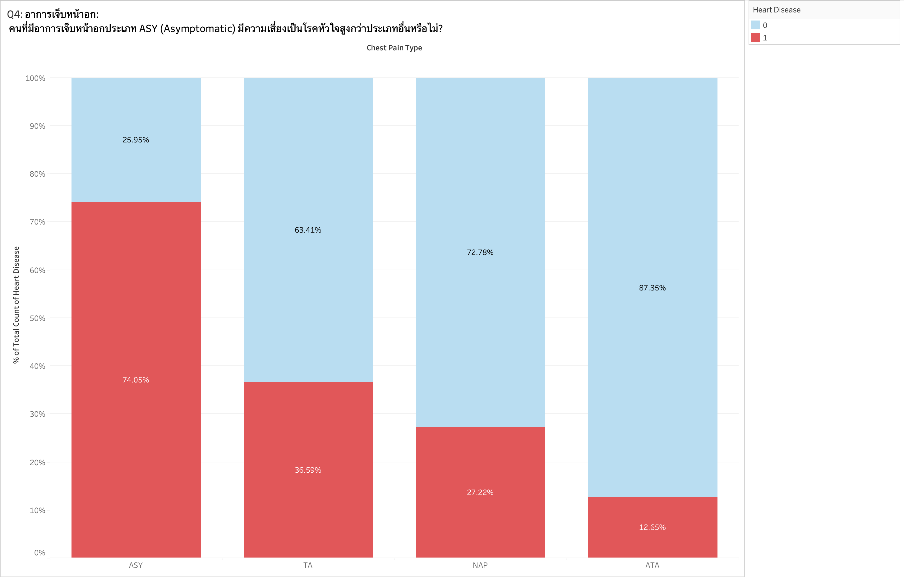
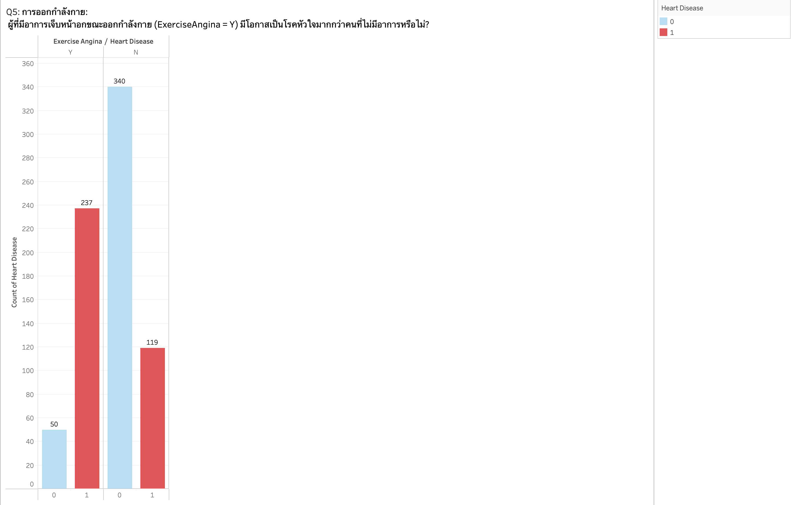
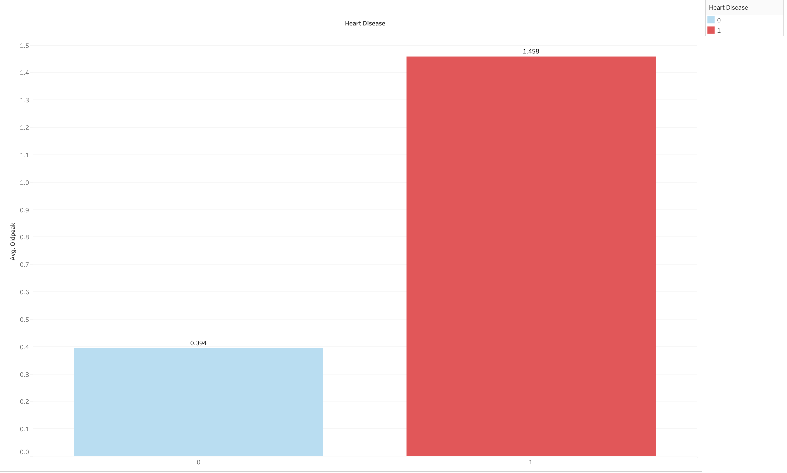

# DS512
# Heart Failure Prediction
โครงการวิเคราะห์ข้อมูลและการสร้างโมเดล Machine Learning

---

## 1. บทนำ (Introduction)

โรคหัวใจเป็นสาเหตุการเสียชีวิตอันดับต้นๆ การวินิจฉัยต้องอาศัยแพทย์ผู้เชี่ยวชาญและเครื่องมือเฉพาะทาง 
ปัญหา คือ เราจะสามารถใช้ข้อมูลจากการตรวจสุขภาพพื้นฐานและอาการทางคลินิก (เช่น อายุ, ระดับคอเลสเตอรอล, ผลคลื่นไฟฟ้าหัวใจ, อาการเจ็บหน้าอก) มาวิเคราะห์เพื่อระบุปัจจัยเสี่ยงที่สำคัญ 
และสร้างแบบจำลองเพื่อทำนายความน่าจะเป็นของการเกิดโรคหัวใจได้อย่างไร เพื่อช่วยในการคัดกรองผู้ป่วยเบื้องต้นอย่างมีประสิทธิภาพ

---

## 2. วัตถุประสงค์ (Objectives)

 เพื่อวิเคราะห์และจัดลำดับปัจจัยทางคลินิก (เช่น ChestPainType, ST_Slope, MaxHR) จำนวน 3-5 อันดับแรก ที่มีความสัมพันธ์กับโรคหัวใจสูงที่สุด (High Correlation) เพื่อใช้เป็นเกณฑ์หลักในการคัดกรองผู้ป่วยกลุ่มเสี่ยงเบื้องต้น ให้แล้วเสร็จภายใน 3 เดือน

---

## 3. คำถามและสมมติฐาน (Questions / Hypothesis)

### คำถาม (Questions)
- เพศมีผลต่อความเสี่ยง โดยคาดว่าเพศชายอาจมีความเสี่ยงในการเกิดโรคหัวใจสูงกว่าเพศหญิง
- ผู้ที่มีอายุมากกว่า มีแนวโน้มที่จะมีความเสี่ยงเป็นโรคหัวใจสูงกว่าผู้ที่มีอายุน้อย
- ผู้ที่มีอาการเจ็บหน้าอกขณะออกกำลังกาย (Exercise Angina = Yes) น่าจะมีความเสี่ยงในการเป็นโรคหัวใจสูงกว่าผู้ที่ไม่มีอาการอย่างชัดเจน
- ผู้ที่มีอาการเจ็บหน้าอก มีแนวโน้มเป็นโรคหัวใจมากกว่าผู้ที่ไม่มีอาการเจ็บหน้าอก
- อัตราการเต้นของหัวใจสูงสุด (MaxHR) น่าจะมีความสัมพันธ์เชิงบวกกับโรคหัวใจ คือ ผู้ที่เป็นโรคหัวใจน่าจะทำ MaxHR ได้สูงกว่าคนปกติ
- ค่า Oldpeak (ST depression) ยิ่งสูง น่าจะยิ่งสัมพันธ์กับโอกาสการเป็นโรคหัวใจที่สูงขึ้น
- ผู้ที่มีลักษณะกราฟ ST Slope แบบ Flat หรือ Down น่าจะมีโอกาสในการเป็นโรคหัวใจ สูงกว่า ผู้ที่มี ST Slope แบบ Up

### สมมติฐาน (Hypothesis)
สามารถทำนายโอกาสในการเป็นโรคหัวใจจากปัจจัยส่วนบุคคล (อายุ เพศ) อาการทางคลินิก (อาการเจ็บหน้าอกขณะออกกำลังกาย, อาการเจ็บหน้าอก) และ ผลตรวจวัดค่าร่างกาย (อัตราการเต้นของหัวใจสูงสุด, ค่า Oldpeak ) ได้

---

## 4. แหล่งที่มาของข้อมูล (Data Source)

- **Dataset:** Heart Failure Prediction Dataset  https://www.kaggle.com/datasets/fedesoriano/heart-failure-prediction/data
- **Source:** Kaggle  
- ข้อมูลถูกจัดเตรียมสำหรับงาน Classification  

---

## 5. Heart Disease Dataset Data Dictionary 

| ชื่อคอลัมน์ (Column Name) | ประเภทข้อมูล (Data Type) | คำอธิบาย (Description) | ค่าที่เป็นไปได้ / ช่วงข้อมูล (Values / Range) |
| :--- | :--- | :--- | :--- |
| **Age** | Integer | อายุของผู้ป่วย | 28 - 77 ปี |
| **Sex** | Categorical | เพศของผู้ป่วย | • `M`: ชาย (Male) • `F`: หญิง (Female) |
| **ChestPainType** | Categorical | ประเภทของอาการเจ็บหน้าอก | • `ATA`: Atypical Angina • `NAP`: Non-Anginal Pain • `ASY`: Asymptomatic • `TA`: Typical Angina |
| **RestingBP** | Integer | ความดันโลหิตขณะพัก (mm Hg) | 92 - 200 |
| **Cholesterol** | Integer | ระดับคอเลสเตอรอลในเลือด (mm/dl) | 85 - 603 |
| **FastingBS** | Binary | ระดับน้ำตาลในเลือดขณะอดอาหาร *(1 ถ้า > 120 mg/dl, 0 ถ้าไม่เกิน)* | • `0`: ปกติ (<= 120 mg/dl) • `1`: สูง (> 120 mg/dl) |
| **RestingECG** | Categorical | ผลการตรวจคลื่นไฟฟ้าหัวใจขณะพัก | • `Normal`: ปกติ • `ST`: มีความผิดปกติของคลื่น ST-T • `LVH`: กล้ามเนื้อหัวใจห้องล่างซ้ายหนาตัว |
| **MaxHR** | Integer | อัตราการเต้นของหัวใจสูงสุดที่ทำได้ | 69 - 202 |
| **ExerciseAngina** | Binary | อาการเจ็บหน้าอกขณะออกกำลังกาย | • `N`: No (ไม่มี) • `Y`: Yes (มี) |
| **Oldpeak** | Float | ภาวะ ST depression ที่เกิดจากการออกกำลังกายเทียบกับขณะพัก | -0.1 ถึง 6.2 |
| **ST_Slope** | Categorical | ความชันของส่วน ST segment ช่วงพีคของการออกกำลังกาย | • `Up`: ชันขึ้น (Upsloping) • `Flat`: ราบเรียบ (Flat) • `Down`: ชันลง (Downsloping) |
| **HeartDisease** | Integer (Target) | **ผลลัพธ์:** เป็นโรคหัวใจหรือไม่ | • `0`: ปกติ (Normal) • `1`: เป็นโรคหัวใจ (Heart Disease) |

---

## 6. การวิเคราะห์ข้อมูลเชิงสำรวจ  
(Exploratory Data Analysis: EDA)

- ตรวจสอบการกระจายของข้อมูลแต่ละตัวแปร  
- วิเคราะห์ความสัมพันธ์ระหว่างตัวแปรด้วย Correlation Heatmap  
- เปรียบเทียบลักษณะข้อมูลระหว่างกลุ่มปกติและกลุ่มผู้ป่วย  
- ใช้กราฟ Bar Chart และ  Pie Chart เพื่อแสดงความแตกต่างของข้อมูล

## 7. Data Cleaning Process

ชุดข้อมูลดิบ มีการบันทึกค่าผิดปกติบางประการ โดยเฉพาะค่าที่เป็น 0 ในตัวแปรทางสรีรวิทยาที่ไม่ควรเป็น 0 จึงได้ทำการคลีนข้อมูลเพื่อความถูกต้องแม่นยำในการวิเคราะห์ ดังนี้:

### 1. Handling Zero Values (Missing Data imputation)
จากการตรวจสอบข้อมูล พบว่ามีค่า `0` ปะปนอยู่ในคอลัมน์ที่สำคัญ ซึ่งในบริบททางการแพทย์ถือว่าเป็นข้อมูลที่ผิดพลาด (Error/Missing) จึงได้ทำการแก้ไขดังนี้:

* **Cholesterol:** พบค่าเป็น `0` จำนวน **172 แถว**
    * *Action:* ทำการแทนที่ (Impute) ค่า 0 เหล่านั้นด้วยค่ามัธยฐาน (Median) ของระดับคอเลสเตอรอล (แยกตามเพศหรือภาพรวม) เพื่อรักษารูปแบบการแจกแจงของข้อมูล

### 2. General Checks
* **Duplicates:** ตรวจสอบข้อมูลซ้ำซ้อน (Duplicate Rows)
* **Missing Values (NaN):** ตรวจสอบค่าว่าง (Null values)

## 8. Key Findings / สรุปผลการวิเคราะห์ข้อมูล

จากการวิเคราะห์ข้อมูลผ่านกราฟต่างๆ สามารถสรุปความสัมพันธ์ของตัวแปรที่สำคัญได้ดังนี้:

### 1. ภาพรวมความสัมพันธ์ของตัวแปร (Correlation Matrix)

*จากกราฟ Heatmap แสดงให้เห็นถึงความสัมพันธ์ระหว่างตัวแปรต่างๆ กับ `HeartDisease` โดยพบว่า:*
- **Oldpeak (0.50):** มีความสัมพันธ์เชิงบวกสูงที่สุด (ยิ่งค่าสูง ยิ่งเสี่ยงมาก)
- **MaxHR (-0.38):** มีความสัมพันธ์เชิงลบ (ยิ่งอัตราการเต้นหัวใจสูงสุดต่ำ ความเสี่ยงยิ่งสูง)
- **ExerciseAngina & ST_Slope:** เป็นตัวแปรที่มีความสำคัญสูงในการบ่งบอกโรค

---

### 2. ความสัมพันธ์ระหว่างอายุกับโรคหัวใจ (Age Distribution)

*คำอธิบาย:*
กราฟแสดงสัดส่วนของผู้ป่วยตามช่วงอายุ จะเห็นแนวโน้มที่ชัดเจนว่า **ยิ่งอายุมากขึ้น ความเสี่ยงในการเป็นโรคหัวใจจะสูงขึ้นตามไปด้วย** โดยเฉพาะในช่วงอายุ 55 ปีขึ้นไปที่มีสัดส่วนผู้ป่วยมากกว่าคนปกติ

---

### 3. อาการเจ็บหน้าอก (Chest Pain Type)

*คำอธิบาย:*
เมื่อเปรียบเทียบประเภทของอาการเจ็บหน้าอก พบว่ากลุ่มที่เป็น **ASY (Asymptomatic - ไม่มีอาการ)** มีความเสี่ยงที่จะเป็นโรคหัวใจสูงที่สุด (กว่า 74%) รองลงมาคือกลุ่ม TA (Typical Angina) ในขณะที่กลุ่ม ATA (Atypical Angina) มีความเสี่ยงต่ำที่สุด

---

### 4. อาการเจ็บหน้าอกขณะออกกำลังกาย (Exercise Angina)

*คำอธิบาย:*
ปัจจัยเรื่องอาการเจ็บหน้าอกขณะออกกำลังกาย (Exercise Angina) เป็นตัวบ่งชี้ที่ชัดเจนมาก
- **กลุ่มที่มีอาการ (Y):** มีโอกาสเป็นโรคหัวใจสูงมาก (แท่งสีแดงสูงกว่าสีฟ้าชัดเจน)
- **กลุ่มที่ไม่มีอาการ (N):** ส่วนใหญ่เป็นคนปกติ

---

### 5. ความชันของช่วง ST (ST Slope)

*คำอธิบาย:*
ลักษณะของกราฟไฟฟ้าหัวใจช่วง ST Slope ส่งผลต่อความเสี่ยงอย่างมีนัยสำคัญ:
- **Flat (ราบ) และ Down (ลง):** มีความเสี่ยงเป็นโรคหัวใจสูงมาก (ประมาณ 70-80%)
- **Up (ขึ้น):** เป็นลักษณะที่พบในคนปกติส่วนใหญ่ (ความเสี่ยงต่ำเพียง 12.89%)

---

### 6. ภาวะ Oldpeak (ST depression induced by exercise)

*คำอธิบาย:*
เมื่อดูค่าเฉลี่ยของ `Oldpeak` พบว่า **ผู้ที่เป็นโรคหัวใจ (แท่งสีแดง) มีค่าเฉลี่ย Oldpeak สูงถึง 1.458** ซึ่งสูงกว่าคนปกติที่มีค่าเฉลี่ยเพียง 0.394 อย่างเห็นได้ชัด แสดงให้เห็นว่า Oldpeak เป็นฟีเจอร์ที่ใช้แยกแยะผู้ป่วยได้ดีมาก

---

## 📝 Conclusion / บทสรุป
 จากการวิเคราะห์ พบว่า อายุ เพศ อาการเจ็บหน้าอกประเภทการเจ็บหน้าอก การเจ็บหน้าอกขณะออกกำลังกายความชันช่วง ST อัตราการเต้นของหัวใจและระดับคอเลสเตอรอล เป็นตัวแปรสำคัญที่ส่งผลต่อการเกิดโรคหัวใจโดยกลุ่มเสี่ยงที่มีโอกาสเป็นโรคหัวใจมากที่สุด คือ

- เพศชายมีโอกาสเป็นโรคหัวใจมากถึง 56%
- อายุ 55 - 75 ปีมีโอกาสเป็นโรคหัวใจมากกว่า 58%
- ผู้ที่ไม่มีอาการเจ็บหน้าอกมีโอกาสเป็นโรคหัวใจมากถึง 74%
- ผู้ที่มีอาการเจ็บหน้าอกขณะออกกำลังกายเป็นกลุ่มเสี่ยงในการเป็นโรคหัวใจ
- ผู้ที่มีความชันของช่วง ST (ST segment) บนคลื่นไฟฟ้าหัวใจ (ECG) แบบ Flat และ Down
- ผู้ที่มีอัตราการเต้นของหัวใจต่ำกว่า 130 bpm เนื่องจากหัวใจอ่อนแรง
- ผู้ที่มีระดับคอเลสเตอรอลสูงกว่า 250 mg/dL
- กลุ่มผู้ป่วยโรคหัวใจมีค่า Oldpeak เฉลี่ยสูงกว่ากลุ่มที่ไม่เป็นโรคหัวใจ โดยค่า Oldpeak คือ ระดับ ST depression ที่ตรวจวัดจากคลื่นไฟฟ้าหัวใจ (ECG) ในช่วงการออกกำลังกายเมื่อเทียบกับขณะพัก

---

## 📝 Recommendation/Action and Impact

- ควรมีการตรวจคัดกรองสุขภาพให้กับประชาชนช่วงอายุ 55-75 ปี เนื่องจากเป็นกลุ่มเสี่ยงสูงที่จะเป็นโรคหัวใจ โดยเฉพาะในกลุ่มเพศชาย
- สร้างความตระหนักถึงภัยเงียบของโรคหัวใจ แม้ว่าจะไม่มีอาการเจ็บหน้าอกเป็นสัญญาณ เนื่องจากยังคงเป็นตัวแปรสำคัญอย่างหนึ่งในการเกิดโรคหัวใจ
- สำหรับผู้ที่ไม่มีอาการเจ็บหน้าอก ควรได้รับการตรวจ ECG เพื่อดู ST Slope และ Oldpeak

